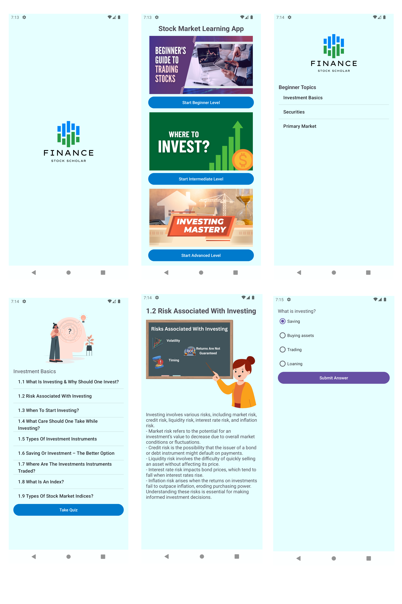

---

# 📈 Stock Market Learning App

Welcome to the **Stock Market Learning App**! This mobile application provides a comprehensive guide to understanding stock markets, investments, and financial instruments. Users can explore modules across different difficulty levels — **Beginner**, **Intermediate**, and **Advanced** — with interactive quizzes to test their knowledge and earn rewards.

## 📱 Features

- **Multi-Level Learning Modules**: Topics divided into Beginner, Intermediate, and Advanced levels.
- **Detailed Lessons**: Each topic includes explanations on essential concepts in investing and stock market operations.
- **Quizzes with Rewards**: Test your knowledge with quizzes at the end of each module. Earn reward points and level up badges for completion.
- **Images & UI**: Visual elements for topics, easy-to-navigate interface.
- **Search & Navigation**: Quickly find topics and subtopics with a built-in search feature.

## 📂 Project Structure

- **Activities**
  - `MainActivity.kt`: Welcome screen with level selection.
  - `ModuleActivity.kt`: Displays topics for the chosen level with images for each.
  - `TopicActivity.kt`: Lists subtopics within a chosen topic.
  - `SubtopicDetailActivity.kt`: Detailed content for each subtopic with images.
  - `QuizActivity.kt`: Quiz interface to test understanding of each module.

- **Layouts**
  - **activity_main.xml**: Main screen layout.
  - **activity_module.xml**: Layout displaying topic list with images.
  - **activity_topic.xml**: Subtopic list layout.
  - **activity_subtopic_detail.xml**: Detailed view for each subtopic with text and images.
  - **activity_quiz.xml**: Quiz screen layout.

## 📘 Topics Covered

### Beginner
1. **Investment Basics**
   - Introduction to investing, types of investment instruments, risks, and more.
2. **Securities**
   - Understanding securities, SEBI regulations, and market participants.
3. **Primary Market**
   - Functions of primary markets, capital-raising methods, and more.

### Intermediate
4. **IPO Basics**
   - What is an IPO, advantages, and investment procedures.
5. **Secondary Market**
   - Types of secondary markets, trading on exchanges, brokerage, and trading costs.
6. **Products in Secondary Market**
   - Equities, debt instruments, portfolio diversification, and stock factors.

### Advanced
7. **Derivatives**
   - Types of derivatives, option premiums, and commodities.
8. **Depositories**
   - Role and functions of depositories, ISIN, custodians, and electronic holdings.
9. **Mutual Funds**
   - Types of mutual funds, NAV, risks, regulatory bodies, and ETFs.

## 🛠️ Getting Started

### Prerequisites

- Android Studio
- Kotlin 1.5+
- Gradle

### Installation

1. Clone the repository:
   ```bash
   git clone https://github.com/giripankaj21/StockLearningApp.git
   ```
2. Open in Android Studio.
3. Build the project and install the app on an emulator or Android device.

### Usage

- Launch the app, select your level (Beginner, Intermediate, or Advanced).
- Explore topics and subtopics with rich content and accompanying images.
- Test your knowledge with quizzes after each module, earn points, and advance your badge.

## 📸 Screenshots



| Screen               | Description                   |
|----------------------|-------------------------------|
| [Main Screen]        | Select Beginner, Intermediate, or Advanced level |
| [Module Screen]     | View topics within each level, with image icons  |
| [Subtopic Screen] | Navigate through detailed subtopics              |
| [Quiz Screen]       | Take quizzes and see your score                  |

## 🚀 Future Enhancements

- **User Profiles**: Track individual progress, quiz scores, and badges.
- **Interactive Graphs**: Visualize investment growth and stock market trends.
- **Real-Time Market Data**: Integrate APIs for live market information.

## 🤝 Contributing

Contributions are welcome! Please follow these steps to contribute:
1. Fork the repository.
2. Create a new branch for your feature.
3. Commit changes and open a pull request.
